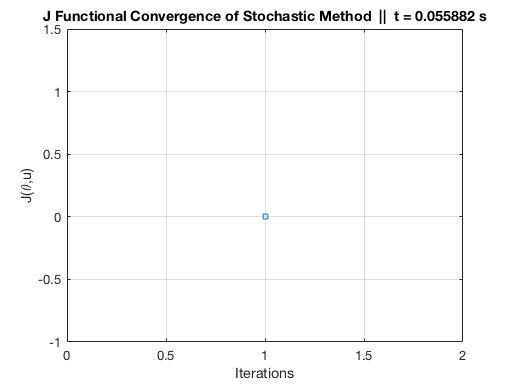
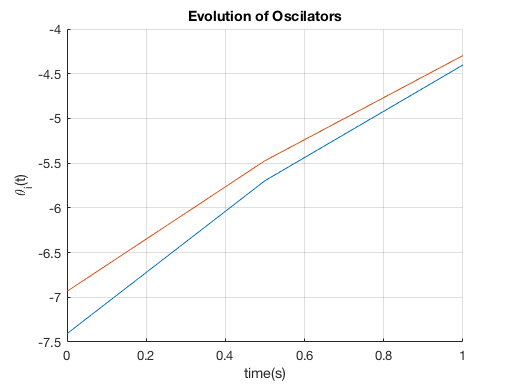
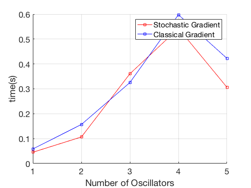

# title: Synchronized Oscillators


## subtitle: Sincronization of coupled oscillator described by the Kuramoto model, using the Stochastic Conjugate Gradient Method


## author: [AnaN,JesusO,UmbertoB]


## date: 2018-10-19


## What's a consensus problem?


We consider a population of N coupled-phase oscillators, dollars\theta_i(t)dollars, dollarsi=1,\ldots,Ndollars and we want to compute a control such that in time dollarsTdollars we reach the state dollars\theta_i(T)=\ldots =\theta_N(T)=:\bar{\theta}dollars in which all the oscillators are sincronized.


## The mathematical model


The dynamics of the oscillators is described by the Kuramoto model


dollars-dollars\dot{\theta}_i(t) = \frac{1}{N}\sum_{j=1}^N \sin(\theta_j(t)-\theta_i(t)) + b_i(t),\;\;\; i=1,\ldots,Ndollars-dollars


dollars-dollars \theta_i(0) = \theta_i^0.dollars-dollars


The model is non-linear, then, we apply a standard linearization process around the steady state dollars\bar{\theta}dollars obtaining


dollars-dollars\dot{\Theta}(t) = A\Theta(t),\;\;\;\Theta(0) = \Theta^0,\;\;\;\Theta =(\theta_1,\ldots,\theta_N)^T.dollars-dollars


By classical techniques, the control is obtained by minimizing the following cost functional, subject to the linearized Kuramoto model, for each node


dollars-dollars J(b_i) = \frac{1}{2N} \sum_{j=1}^N(\theta_j(T)-\theta_i(T))^2+\frac{\beta}{2}\int_0^T b_i(t)^2dt,\;\;\;\beta>0,dollars-dollars


in which


- the first term measures the distance between the rest of nodes and the target.


- the second term is a penalization one introduced in order to   avoid using control with a too large size.


In fact, through the above minimization procedure, we find the control dollarsb = (b_1,\ldots,b_N)dollars which has minimum norm among all the controls capable to steer the system to the equilibrium dynamics.


## How do you usually solve this type of problem?


The usual technique for solving minimizing problems based on quadratic functionals is the Gradient Descent Method, which is based on the following iterative algorithm


dollars-dollars b^{k+1}_i = b^k_i - \eta\nabla J(b_i^k).dollars-dollars


This technique is tipycally chosen because: - It is (relatively) easy to implement. - It is not very memory demanding.


## What we propose?


As the functional J(b_i) depend on all nodes dollars\Theta_jdollars, the gradient dollars\nabla J(b_i)dollars too. Therefore, in each iteration of the Gradient Descent algorithm we shall consider all nodes in the network. Then, when the number of nodes is large, the complexity if substantial per iteration. To avoid evaluate the full gradient, we propose to approach the problem by means of the Stochastic Descent Gradient method which only uses a small portion of data.


Matrix dollarsAdollars of the linearized Kuramoto model


```matlab
N = 2;
A = (1/N)*ones(N,N);
for i = 1:N
    A(i,i) = -1;
end
A
```


```

A =

   -1.0000    0.5000
    0.5000   -1.0000


```


Initial condition: dollars-dollars\Theta(0) = \Theta^0.dollars-dollars


```matlab
mu = 4;sigma = 10;
theta0 = normrnd(mu,sigma,N,1)
```


```

theta0 =

   -7.4068
   -6.9334


```


Now, choose initial control,


```matlab
t0 = 0;T = 1;dt = 0.5;
tspan = t0:dt:T;
u0 = zeros(length(tspan),N);
```


We can solve with the StochasticGradient function.


```matlab
Results_Stochastic =  StochasticGradient(A,theta0,tspan,u0);
```


And see the convergence


```matlab
fig1 = JPlotConvergence(Results_Stochastic,'Convergence of Stochastic Method');
```




We can see the result obtained


```matlab
fig2 = LastThetaPlot(Results_Stochastic);
```





## Comparison Clasical vs Stochastic


In this example, we show that stochastic method is faster than the classical descent in a small network.


```matlab
Results_Classical = {};Results_Stochastic = {};
%
maxN = 5; % &lt;=== Maximal number of oscillator allowed in the model
iter = 0;
for N = 1:1:maxN
    % We solve the problem for each N
    iter = iter + 1;
    % Definition of the linearized Kuramoto problem
    A = (1/N)*ones(N,N);
    for i = 1:N
        A(i,i) = -1;
    end
    % Initial state
    mu = 4;sigma = 5;
    theta0 = normrnd(mu,sigma,N,1);
    % Initial control
    t0 = 0;T = 1;dt = 0.1;
    tspan = t0:dt:T;
    u0 = zeros(length(tspan),N);

    % Classical Gradient Method
    Results_Classical{iter}  =  ClassicalGradient(A,theta0,tspan,u0);
    % Stochastic Gradient Method
    Results_Stochastic{iter} =  StochasticGradient(A,theta0,tspan,u0);
end
```


We can graphically see the following result. If the number of nodes increase we can see better the efectiveness of the stochastic gradient descent method with respect to the classical.


```matlab
% For the next step it is necessary to convert the cells into arrays
Results_Classical  = [Results_Classical{:}];
Results_Stochastic = [Results_Stochastic{:}];
%
fig2 = figure; ax  = axes;
ax.FontSize = 17;
ax.XLabel.String = 'Number of Oscillators'; ax.YLabel.String = 'time(s)';
ax.XGrid = 'on'; ax.YGrid = 'on';
%
line([Results_Stochastic.N],[Results_Stochastic.t],'Parent',ax,'Color','red','Marker','s')
line([Results_Classical.N],[Results_Classical.t],'Parent',ax,'Color','blue','Marker','s')
legend({'Stochastic Gradient','Classical Gradient'})
```




Altough in this example we are dealing with a small network, we have shown that stochastic method is faster than the classical descent. If the number of nodes increase we can see better the efectiveness of the stochastic gradient descent method with respect to the classical. 


